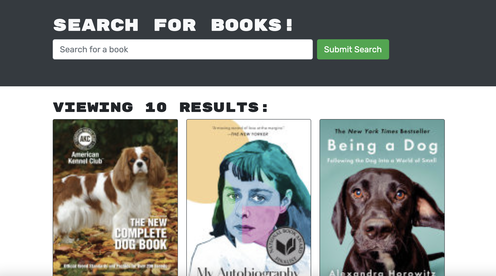

# Book Search Engine

## Description

This application was one that was based off of the REST api and was refactored into one that uses GraphQl api. A user can create a profile, then search for books, and save ones that they are interested in!

## Installation

For this application please clone the repo and run npm i then npm run develop. Once you do,
you can visit your localhost to check it out.

## Usage

Here is a screen shot of the application: 

